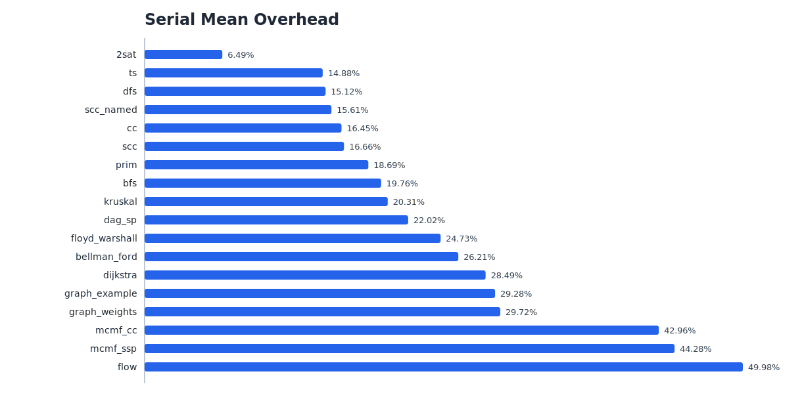
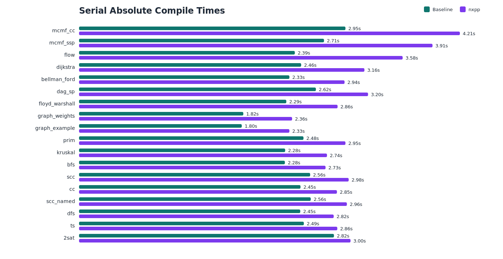
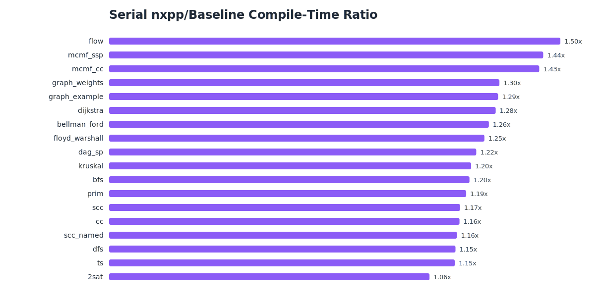
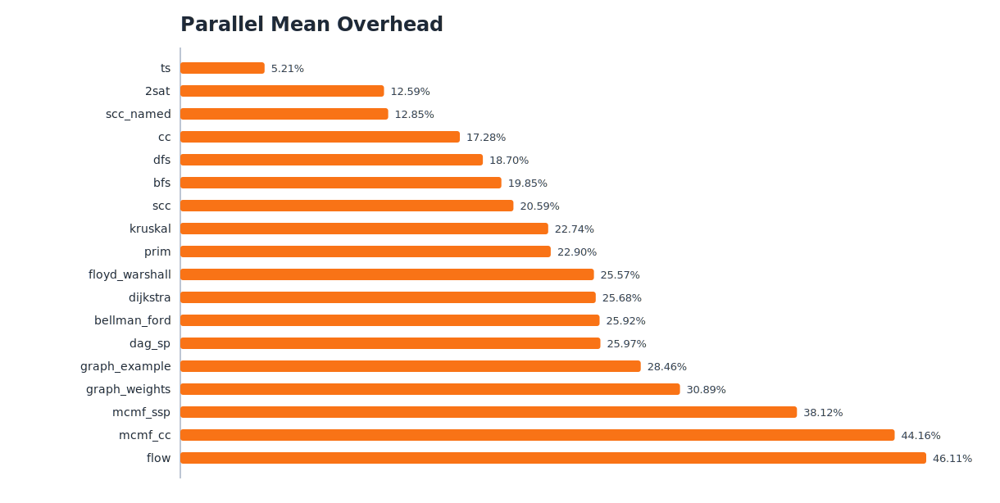
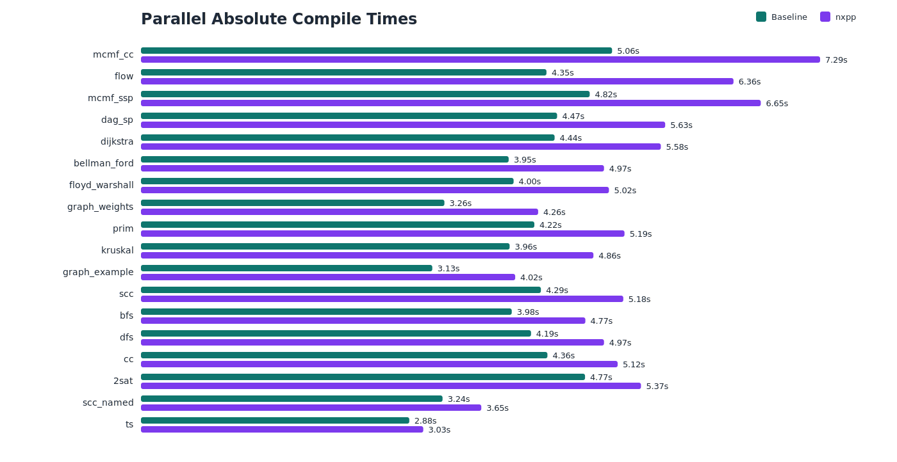
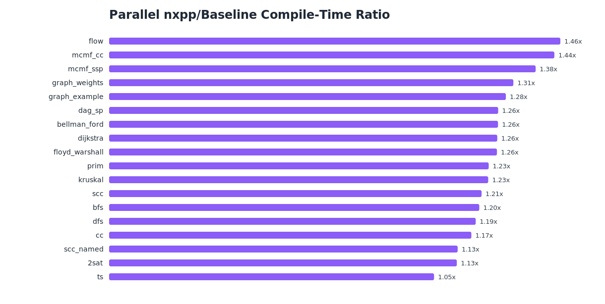
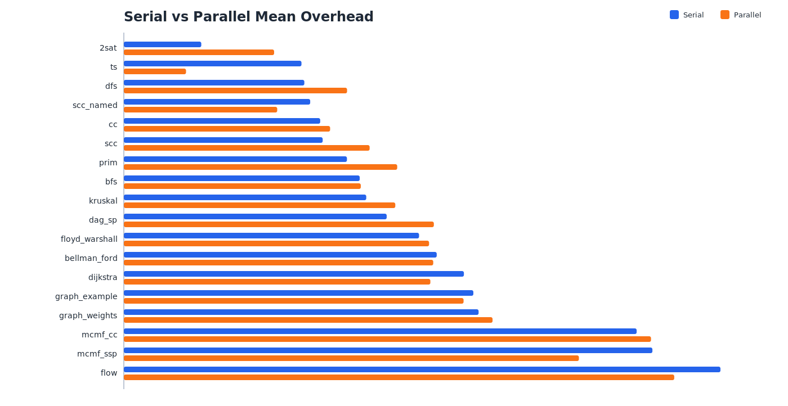
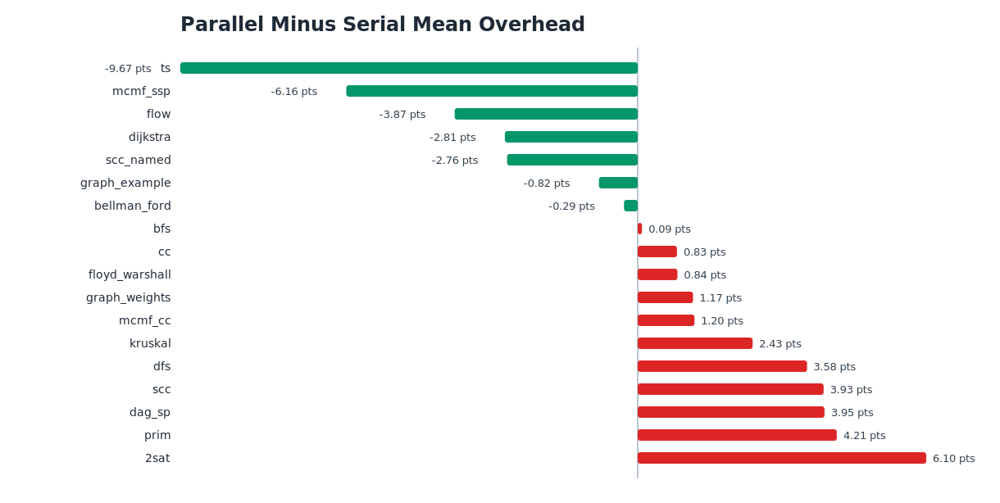
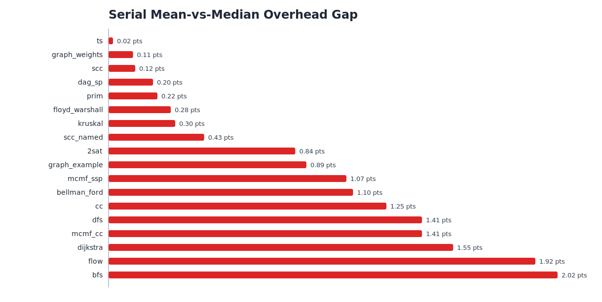
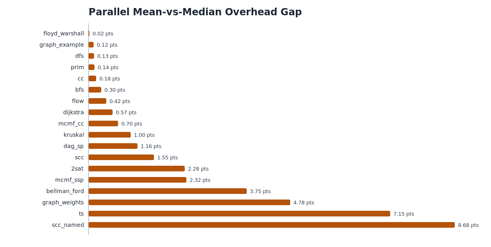

# Benchmark Report

Generated: `2026-03-30 00:08:59 UTC`

## Run Configuration

- target: `all`
- iterations: `3`
- optimization: `O3`
- parallel jobs: `4`
- serial CSV: `serial_all_i3_20260330_000147.csv`
- parallel CSV: `parallel_all_i3_j4_20260330_000147.csv`

## Statistical Overview

- snippets analyzed: `18`
- serial mean-overhead average: `24.54%`
- serial mean-overhead median: `21.16%`
- serial overhead stddev across snippets: `11.16`
- parallel mean-overhead average: `24.64%`
- parallel mean-overhead median: `24.23%`
- parallel overhead stddev across snippets: `10.22`
- average serial mean-vs-median gap: `0.84` points
- average parallel mean-vs-median gap: `1.96` points

## Serial Benchmark

Lowest serial overhead:

- `2sat`: `6.49%`
- `ts`: `14.88%`
- `dfs`: `15.12%`
- `scc_named`: `15.61%`
- `cc`: `16.45%`

Highest serial overhead:

- `flow`: `49.98%`
- `mcmf_ssp`: `44.28%`
- `mcmf_cc`: `42.96%`
- `graph_weights`: `29.72%`
- `graph_example`: `29.28%`

Fastest serial nxpp compile times:

- `graph_example`: `2.33s`
- `graph_weights`: `2.36s`
- `bfs`: `2.73s`
- `kruskal`: `2.74s`
- `dfs`: `2.82s`

Slowest serial nxpp compile times:

- `mcmf_cc`: `4.21s`
- `mcmf_ssp`: `3.91s`
- `flow`: `3.58s`
- `dag_sp`: `3.20s`
- `dijkstra`: `3.16s`

## Parallel Benchmark

Lowest parallel overhead:

- `ts`: `5.21%`
- `2sat`: `12.59%`
- `scc_named`: `12.85%`
- `cc`: `17.28%`
- `dfs`: `18.70%`

Highest parallel overhead:

- `flow`: `46.11%`
- `mcmf_cc`: `44.16%`
- `mcmf_ssp`: `38.12%`
- `graph_weights`: `30.89%`
- `graph_example`: `28.46%`

Fastest parallel nxpp compile times:

- `ts`: `3.03s`
- `scc_named`: `3.65s`
- `graph_example`: `4.02s`
- `graph_weights`: `4.26s`
- `bfs`: `4.77s`

Slowest parallel nxpp compile times:

- `mcmf_cc`: `7.29s`
- `mcmf_ssp`: `6.65s`
- `flow`: `6.36s`
- `dag_sp`: `5.63s`
- `dijkstra`: `5.58s`

## Serial vs Parallel Comparison

Most improved in parallel:

- `ts`: `-9.67 pts`
- `mcmf_ssp`: `-6.16 pts`
- `flow`: `-3.87 pts`
- `dijkstra`: `-2.81 pts`
- `scc_named`: `-2.76 pts`

Most degraded in parallel:

- `2sat`: `6.10 pts`
- `prim`: `4.21 pts`
- `dag_sp`: `3.95 pts`
- `scc`: `3.93 pts`
- `dfs`: `3.58 pts`

## Mean vs Median Consistency

Largest serial mean-vs-median gaps:

- `bfs`: `2.02 pts`
- `flow`: `1.92 pts`
- `dijkstra`: `1.55 pts`
- `dfs`: `1.41 pts`
- `mcmf_cc`: `1.41 pts`

Largest parallel mean-vs-median gaps:

- `scc_named`: `8.68 pts`
- `ts`: `7.15 pts`
- `graph_weights`: `4.78 pts`
- `bellman_ford`: `3.75 pts`
- `mcmf_ssp`: `2.32 pts`

## Interpretation

- This report intentionally uses only the two final CSVs produced by the serial and parallel benchmark scripts.
- That keeps the output simple: one serial CSV, one parallel CSV, one Markdown report, and plots under `benchmark/imgs/`.
- Even with just those two CSVs, we still get a useful cross-section of the benchmark story: aggregate overhead, absolute compile times, nxpp-to-baseline ratios, serial-vs-parallel deltas, and mean-vs-median consistency per snippet.
- A true per-iteration variance study would need raw run data, but this tool now deliberately avoids generating extra CSV artifacts.
